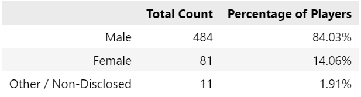
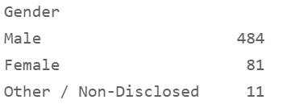
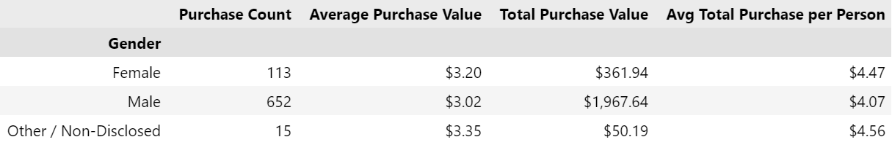
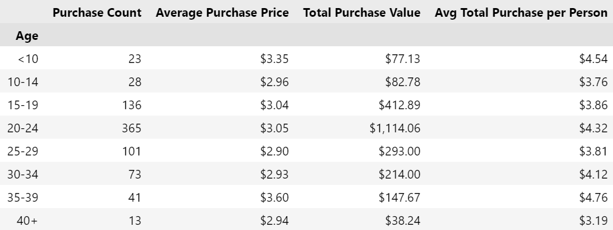
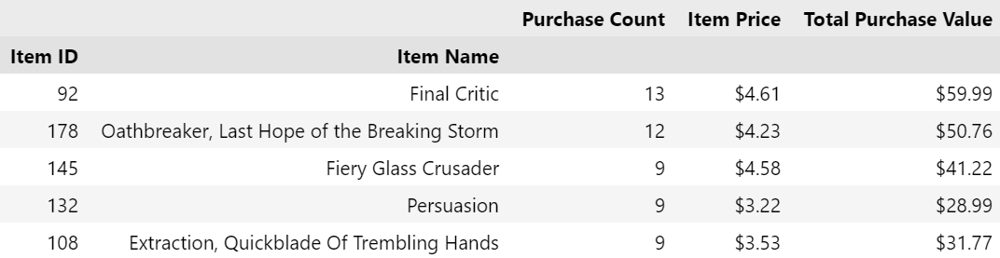
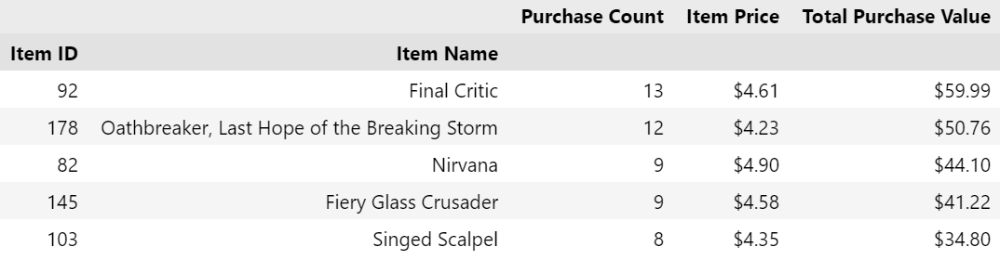

# Pandas Project

## Heroes of Pymoli

### Task

The task is to analyse the data for an independent gaming company for their most recent fantasy game Heroes of Pymoli. A report is generated that breaks down the game's purchasing data into meaningful insights.

The final report includes each of the following:

### Player Count

* Total Number of Players

### Purchasing Analysis (Total)

* Number of Unique Items
* Average Purchase Price
* Total Number of Purchases
* Total Revenue

### Gender Demographics

* Percentage and Count of Male Players
* Percentage and Count of Female Players
* Percentage and Count of Other / Non-Disclosed

### Purchasing Analysis (Gender)

* The below each broken by gender
  * Purchase Count
  * Average Purchase Price
  * Total Purchase Value
  * Average Purchase Total per Person by Gender

### Age Demographics

* The below each broken into bins of 4 years (i.e. &lt;10, 10-14, 15-19, etc.)
  * Purchase Count
  * Average Purchase Price
  * Total Purchase Value
  * Average Purchase Total per Person by Age Group

### Most Popular Items

* The 5 most popular items by purchase count:
  * Item ID
  * Item Name
  * Purchase Count
  * Item Price
  * Total Purchase Value

### Most Profitable Items

* The 5 most profitable items by total purchase value:
  * Item ID
  * Item Name
  * Purchase Count
  * Item Price
  * Total Purchase Value

